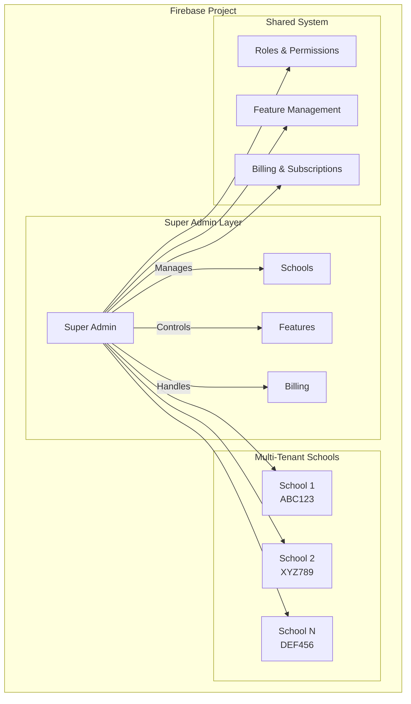
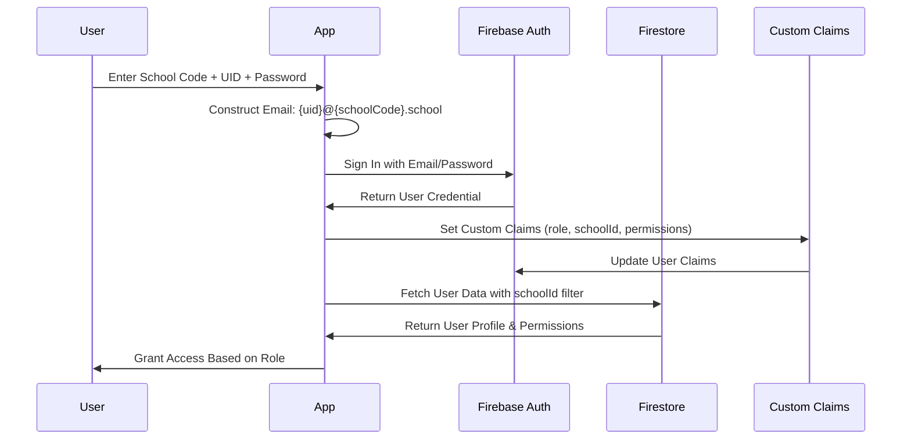
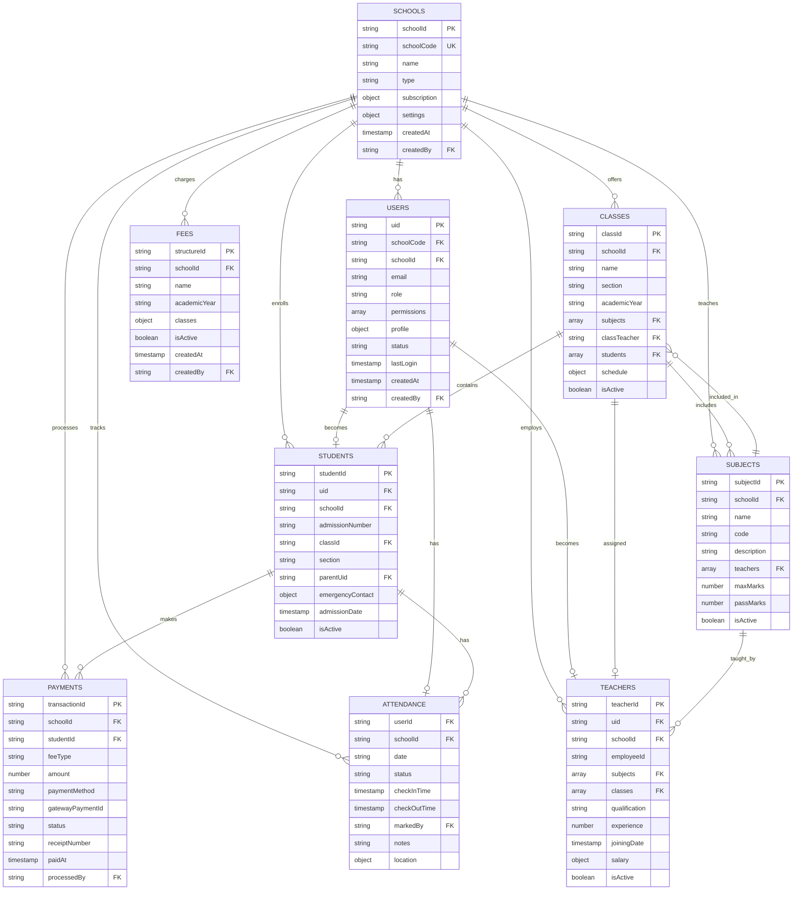
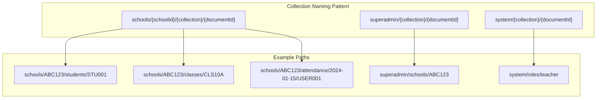
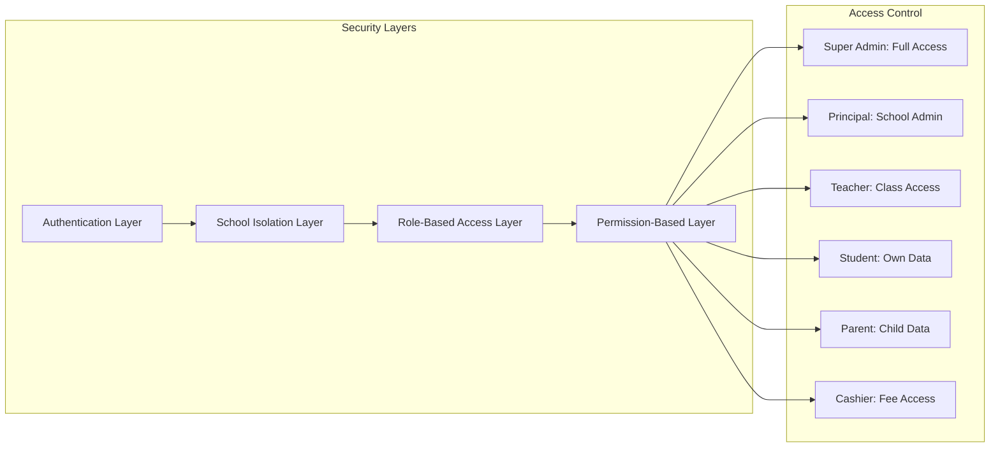
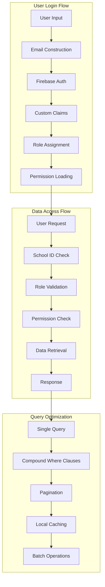
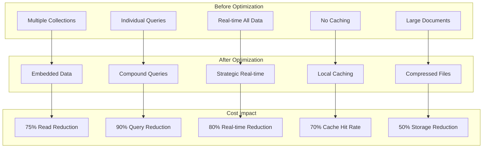
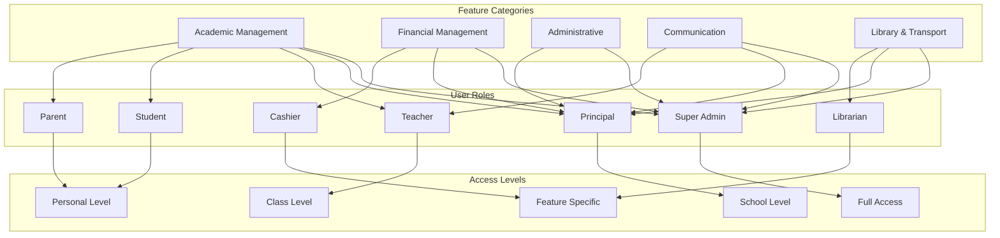
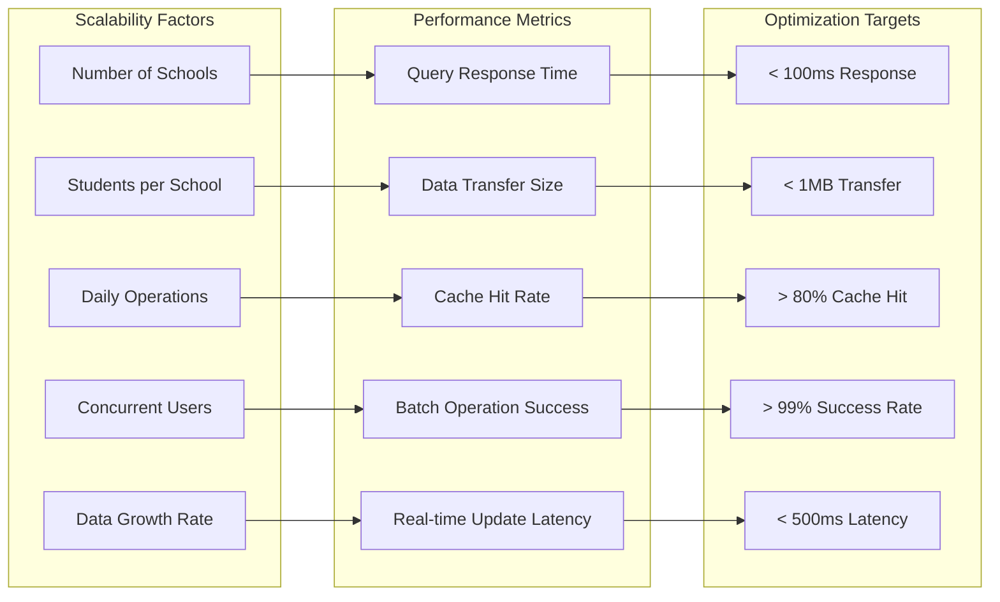

DATABASE VISUALISATION
# Database Structure Visualization - School Management SaaS

## 🏗️ Complete Database Architecture

### 1. High-Level System Overview


### 2. Core Collections Structure
```mermaid
graph TD
    subgraph "Root Collections"
        Users["users/{uid}"]
        Schools[schools/{schoolId}]
        SuperAdmin[superadmin/]
        System[system/]
    end
    
    subgraph "School-Specific Collections"
        SchoolProfile[schools/{schoolId}/profile]
        SchoolUsers[schools/{schoolId}/users/{uid}]
        SchoolStudents[schools/{schoolId}/students/{studentId}]
        SchoolTeachers[schools/{schoolId}/teachers/{teacherId}]
        SchoolClasses[schools/{schoolId}/classes/{classId}]
        SchoolSubjects[schools/{schoolId}/subjects/{subjectId}]
    end
    
    subgraph "Academic Collections"
        Attendance[schools/{schoolId}/attendance/{date}/{userId}]
        AttendanceSummary[schools/{schoolId}/attendanceSummary/{userId}/{month}]
        Marks[schools/{schoolId}/marks/{studentId}/{examId}]
        ReportCards[schools/{schoolId}/reportCards/{studentId}/{termId}]
    end
    
    subgraph "Financial Collections"
        FeeStructure[schools/{schoolId}/feeStructure/{structureId}]
        StudentFees[schools/{schoolId}/studentFees/{studentId}/{academicYear}]
        FeeTransactions[schools/{schoolId}/feeTransactions/{transactionId}]
    end
    
    subgraph "Communication Collections"
        Announcements[schools/{schoolId}/announcements/{announcementId}]
        Notifications[schools/{schoolId}/notifications/{userId}/{notificationId}]
        Events[schools/{schoolId}/events/{eventId}]
    end
    
    subgraph "Operational Collections"
        Library[schools/{schoolId}/library/books/{bookId}]
        Transport[schools/{schoolId}/transport/routes/{routeId}]
        Inventory[schools/{schoolId}/inventory/{itemId}]
    end
    
    Schools --> SchoolProfile
    Schools --> SchoolUsers
    Schools --> SchoolStudents
    Schools --> SchoolTeachers
    Schools --> SchoolClasses
    Schools --> SchoolSubjects
    Schools --> Attendance
    Schools --> AttendanceSummary
    Schools --> Marks
    Schools --> ReportCards
    Schools --> FeeStructure
    Schools --> StudentFees
    Schools --> FeeTransactions
    Schools --> Announcements
    Schools --> Notifications
    Schools --> Events
    Schools --> Library
    Schools --> Transport
    Schools --> Inventory
```

### 3. User Authentication & Role Flow


### 4. Data Relationships & References


### 5. Collection Hierarchy & Naming Convention


### 6. Security Rules Structure


### 7. Data Flow & Query Patterns


### 8. Cost Optimization Structure


### 9. Feature Access Control Matrix


### 10. Scalability & Performance Metrics


---

## 📊 Key Design Principles

### 1. **Multi-Tenant Isolation**
- Each school's data is completely isolated
- School ID is included in every collection path
- Security rules enforce school boundaries

### 2. **Role-Based Access Control**
- Super Admin: Full system access
- Principal: Complete school management
- Teacher: Class and student access
- Student/Parent: Personal data only
- Cashier: Fee-related operations
- Librarian: Library operations

### 3. **Cost Optimization**
- Embedded data reduces read operations
- Compound queries minimize multiple requests
- Pagination handles large datasets
- Local caching reduces server calls
- Batch operations for bulk updates

### 4. **Security & Privacy**
- Firebase Auth with custom claims
- Firestore security rules
- Input validation and sanitization
- Rate limiting and monitoring
- Audit logging for compliance

### 5. **Performance & Scalability**
- Efficient indexing strategy
- Strategic use of real-time updates
- Offline-first approach with sync
- Optimized file storage
- Load balancing considerations

This visual representation shows the complete database architecture designed for your School Management SaaS platform, highlighting the relationships, security layers, and optimization strategies that will ensure cost-effectiveness, security, and scalability.

